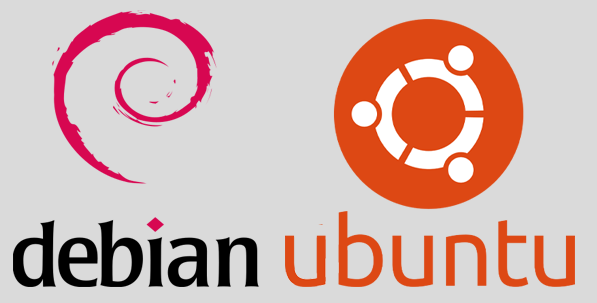

<!DOCTYPE html>
<h2 align="center">

WildySheverando VPN Script Version 3.0
<h2>

<!---- © Copyright 2021 By Wildy Sheverando ------>
<h3 align="center">
Operating System Supported
</h3>

<h3 align="center">
Addons Service
</h3>

  <h2>

  </h2>

## ❗ OS Supported ❗
<b>
✔ Debian 8 (X86_64) (X86) (X64) 
✔ Debian 9 (X86_64) (X86) (X64) 
✔ Debian 10 (X86_64) (X86) (X64) 
✔ Ubuntu 16.04 (X86_64) (X86) (X64) 
✔ Ubuntu 18.04 (X86_64) (X86) (X64) 
✔ Ubuntu 20.04 (X86_64) (X86) (X64) 
✔ Ubuntu 20.10 (X86_64) (X86) (X64) 
❌ Centos 6 ( Not Supported ) 
❌ Centos 7 ( Not Supported ) 
❌ Centos 8 ( Not Supported )  
</b>

## 🔰 Feature Script 🔰
<b>
✔ SSH / Tunneling 
✔ Dropbear 2017-2020  
✔ Stunnel 4 
✔ Squid3 
✔ V2Ray 4.36.2 
✔ Trojan-gfw 1.16.0 
✔ Anti Torrent ( Firewall Blocked )  
✔ DDOS Flate  
✔ AutoExpired User ( SSH ) 
✔ Userdel ( SSH ) 
✔ Userdel ( Trojan ) 
✔ Userdel ( V2Ray ) 
✔ Useradd ( SSH ) 
✔ Useradd ( Trojan ) 
✔ Useradd ( V2Ray ) 
✔ CreateTrial ( SSH ) 
✔ CreateTrial ( Trojan ) 
✔ CreateTrial ( V2Ray ) 
✔ CheckUser Login ( SSH ) 
✔ Speedtest CLI ( By speedtest.net ) 
✔ TLS ( 1.2 & 1.3 Supported )  
✔ Multi User On 1 Port ( V2Ray ) 
✔ Multi User On 1 Port ( Trojan ) 
✔ AutoReboot 01:00 ( WIB / Indonesian - Jakarta Time ) 
✔ Ram Usage Checking 
✔ CPU Usage Checking 
✔ Ram Total Checking 
✔ Ram Avaible Checking 
✔ Storage Usage Checking 
✔ Storage Total Checking 
✔ Storage Avaible Checking 
✔ Bandwidth Usage From Boot Checking 
✔ ISP Detail Checking 
✔ AutoExpired SSH User On 01:00 ( WIB / Indonesian - Jakarta Time ) 
</b>

## 🔰 Port Information 🔰
<b>
🔸 Port 22   = OpenSSH 
🔸 Port 110  = DropBear 
🔸 Port 143  = DropBear 
🔸 Port 443  = Stunnel4 
🔸 Port 990  = Stunnel4 
🔸 Port 8080 = Squid 
🔸 Port 3128 = Squid 
🔸 Port 1945 = V2Ray HTTPS ( TLS V2Ray ) 
🔸 Port 80   = V2Ray HTTP ( NonTLS V2Ray ) 
🔸 Port 442  = Trojan TLS ( trojan-gfw ) 
🔸 Port 7100 = BadVPN  
🔸 Port 7200 = BadVPN 
🔸 Port 7300 = BadVPN 
🔸 Port 2907 = Roaming Port  
</b>

## 🚫 PLEASE READ 🚫
<b>
❌ THIS SCRIPT IS NOT FOR SALE ( FREE FOR PERSONAL USE )  
❌ IF I KNOW SELLING THIS SCRIPT I WILL TURN OFF THIS SCRIPT  
</b>

## 😍 THANKS 😍
<b>
Thank Very Much To Horas Siregar ( From VPNSTORES ) & The Hoster ( From Fastssh )  
Nico_Joy ( From Fastssh ) For Helping / Giving Solution In Creating This Script
</b>

## ❤ Copyright & License ❤
<b>© Copyright 2021 by WildySheverando ( <a href="https://github.com/wildysheverando-project/autoscript.github.io">Repository</a> )</b>  
<b>Licensed under the terms of the ( GNU GENERAL PUBLIC LICENSE Version 3, 29 June 2007 )</b>

## ⏩ Installation ⏪
> rm -f setup.sh && apt-get update -y && apt-get upgrade -y && apt install screen zip ftp bzip2 gzip coreutils wget curl neofetch -y && wget -O setup.sh https://raw.githubusercontent.com/wildysheverando-project/autoscript.github.io/main/setup.sh && chmod +x setup.sh && screen -S setup ./setup.sh

## 🔱 PREMIUM USER 🔱
▶ For Upgrade To Premium User , Contact Me : 
▶ Telegram : https://t.me/wildysheverando 
▶ Whatsapp : https://wa.me/6285830878000 
<b>PLEASE DO NOT USE VOICE CALL & VIDEO CALL</b>

## ➕ DONATION ➕
<b>If you want to help develop this project, you can donate as sincere as possible</b>
 
<b>
▶ Paypal : paypal.me/wildyvpnscript 
▶ Dana   : 0858-3087-8000 
</b>

## Thanks For Using My Script

### By WildySheverando
